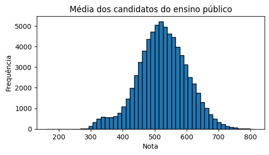
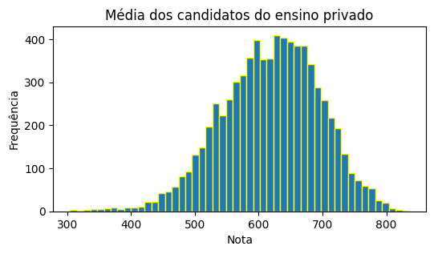
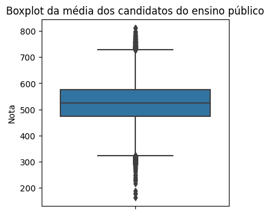
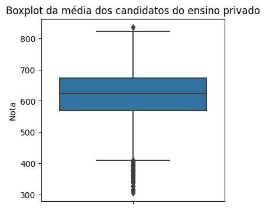

# MICRODADOS ENEM 2022
 O projeto tem como objetivo a construção de modelos de machine learning utilizando microdados do Enem 2022.

 ## Visualização dos dados 

  
   

___

  
  

O Python apresentou limitações na leitura dos microdados, o csv contém mais de 4 milhões de linhas. Posteriormente realizar um teste na linguagem Go, tem a fama de performar melhor.

